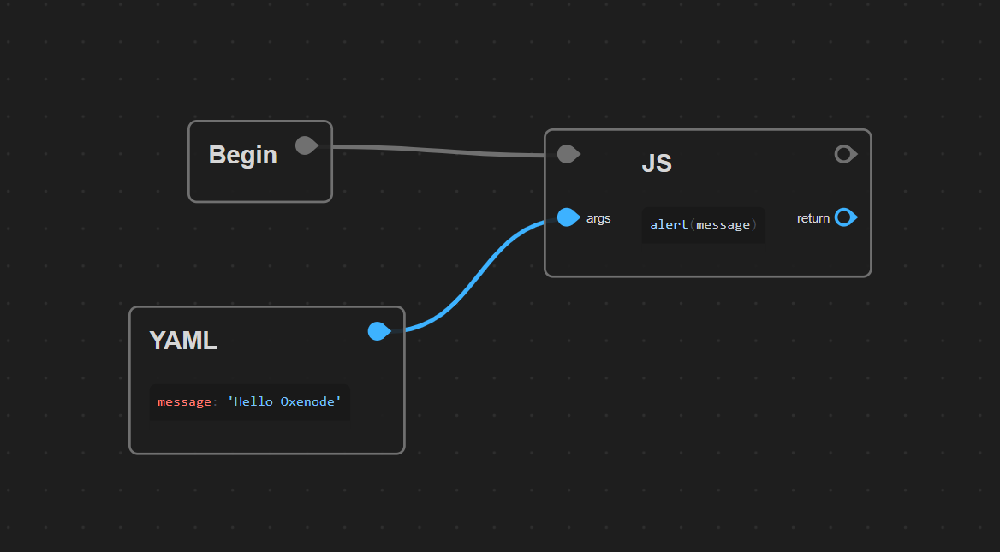
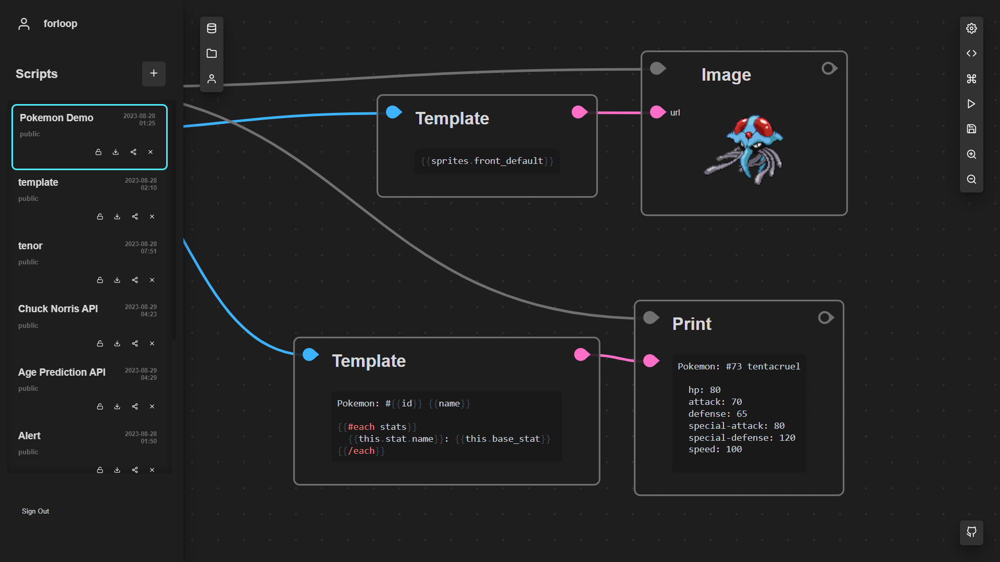
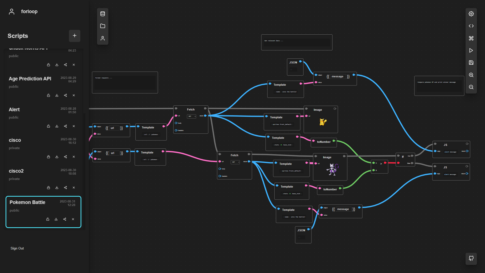

# Oxenode

### Create, Prototype and Share Visual Scripts through the Web.

    

 

### Fetch APIs 

    

    

  

# Collection of Oxenode Scripts

> NOTE: You need a Private Alpha Key to use these scripts. This project is not yet public due the lack of maturity (It will be open source eventually). Contact `matiasvlevi@gmail.com` to get a Private Alpha Key

 

#### Basic

[Simple Alert](https://oxenode.io/script/64ebfd6d75803061fb04b6b9) 
[Templates](https://oxenode.io/script/64ec021e75803061fb04b6bb)

#### APIs

[Gif Api](https://oxenode.io/script/64ec51f6cd3c12e86b82d788) 
[Pokemon Api](https://oxenode.io/script/64ebf798390916cc55723204) 
[Pokemon Battle](https://oxenode.io/script/64f087842d65b8bea5f8dc76) 
[Chuck Norris Api](https://oxenode.io/script/64ed72df2d65b8bea5f8dc68) 
[Age Api](https://oxenode.io/script/64ed743c2d65b8bea5f8dc6c) 
